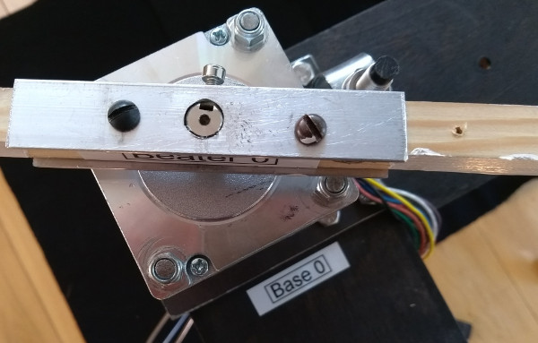

% Loeffler *H*


# Setup and assembly

## Software setup

1. Get the code from [GitHub](https://github.com/markk/loeffler-h). Click the
   `Clone or download` button and then `Download ZIP`.
1. Extract the zip archive in your `~/Documents` folder and rename the folder
   to `loeffler-h`.
1. This documentation will now be available locally at
   `~/Documents/loeffler-h/README.html`.
1. Install [SuperCollider](https://supercollider.github.io/download).
1. Start the `SuperCollider IDE` and open the file
   `~/Documents/loeffler-h/supercollider/run.scd`.
1. Follow the instructions to install the class.
1. Read the rest of the `run.scd` file for details on running the software.

## Equipment required

- 8-channel mixer
- Stereo PA
- 4 × double-braced percussion stands, with 1 inch (25.4mm) diameter upper tube
- XLR and TS jack cables
- Headphone amplifier for click-track

## Tools

### Included {.unnumbered}

- ratchet with 8mm (M4) and 10mm (M6) sockets
- mini screwdriver set
- hex key set

### Required {.unnumbered}

- flat-head screwdriver
- Phillips-head screwdriver
- adjustable spanner
- gaffer tape

## Parts

### Peli Storm Case iM2500

*55 × 36 × 23cm, 15kg*

- 2 × Leadshine Power Supply SPS487
- 4 × Leadshine Stepper Drivers EM806
- 4 × SY60STH86 Stepper Motors
- Electronics unit, consisting of:
    - 4 × Pololu A-Star 32U4 Microcontrollers
    - Anker 4-port USB hub

### Hardcase HN40W

*102 × 31 × 31cm, 17kg*

- 1 × LX1203 AC/DC power adapter 12V
- 4 × Balluff BES M08EG Inductive Sensors
- 20 × microtonally tuned tuning forks
- 5 × rotating beaters
- 4 × Steel mounting bracket
- 4 × Plywood base
- 2 × Plywood brace
- 4 × Perspex guide
- 4 × Chipboard tablet support
- 4 × Resonance box with attached contact microphone
- 1 × Spare contact microphone
- 2 × Telephone pickup microphone with 6.25mm jack socket connections
- 4 × Telephone pickup microphone with 3.5mm jack plug connections
- 2 × Mono 3.5mm→6.25mm plug adapter

#### Cables

- 1 × Euro plug kettle cable
- 1 × UK plug kettle cable
- 1 × UK→Euro power adapter
- 1 × UK→CH power adapter
- 1 × USB extension cable
- 6 × 5-pin XLR extension cable
- 1 × 3.5mm jack extension cable
- 1 × USB→RJ11 serial adapter cable (not required for normal operation)

#### Bolts, Nuts, Washers

- 16 × M4 long threaded bolts with attached lock-nuts
- 20 × M4 washers
- 32 x M4 hex nuts
- 4 × M4 12mm screws
- 8 × M4 25mm screws
- 24 × M6 40mm bolts
- 24 × M6 hex nuts
- 24 × M6 17mm washers
- separate bag containing spares of all of these

## Hardware assembly

1. Attach `Motor`s to steel brackets, matching motor numbers and orienting the
   motor cables to the wide side of the bracket. Use four long M4 bolts, with
   washers and nuts. Tighten diagonally opposite bolts in order. Ensure the
   lock-nuts on the top of the motors are flush with the bolt. Tighten well as
   this will not be accessible later.
   

1. Attach `Sensor`s to steel brackets, matching the numbers. Use one 12mm M4
   screw, with a washer and nut. Tighten well as this will not be accessible
   later.
   

1. Attach `Motor` assemblies to `Base` boards on outer bolts with two 17mm
   washers and M4 nuts. Do not tighten yet.
   

1. Insert into percussion stands and adjust all four motors to the same height.

1. Join `Motor 0` to `Motor 1` with `Brace A` (underneath) using four M6 bolts.
   Include a washer on the brace side.
   

1. Join `Motor 2` to `Motor 3` with `Brace B`.

1. Tighten all 6 nuts on the underside of each motor assembly.
   

1. Attach `Beater`s to each motor and firmly tighten with the hex key. The top
   of the motor shaft should be flush with the top of the beater.
   

1. Check the beater can rotate freely without hitting the `Sensor`. The screw
   on the beater should pass directly over the sensor with a clearance of 1 mm.
   The sensor can be adjusted to align if necessary by bending the metal
   bracket or changing the height with the nuts. The depth of the beater screws
   can also be adjusted with a screwdriver.
   

1. Attach perspex `Guide`s with 25mm M4 screws and nuts. Do not overtighten.
   

1. If using a tablet score reader, attach the `Tablet support`s using 35mm M6
   bolts and nuts.
   

## Electrical connections

1. Carefully remove the top two layers of packing foam from the driver box and
   store safely. **Do not run the motors with this foam in place!**

1. Connect output cables from the `Driver box` to the `Motor` and `Sensor`
   cables. There are four 5-pin XLR extension cables included if necessary for
   the motor cables; the sensor cables can be extended with standard 3-pin XLR
   microphone cables. Keep cable runs as short as possible and take care never
   to stress the cable attachments to the electronics and driver units.

1. Gently plug the `Electronics Power` adapter into the barrel-jack socket on
   the left-hand end of the electronics unit.
   

1. With the `Main Power` off, plug in the `Electronics Power`. The LEDs on the
   bottom of each sensor should be on unless the beater is over it. Check the
   beaters rotate freely and the sensor lights switch on and off accordingly.
   Adjust sensors if necessary. Leave the beaters turned so that one end is
   above the guide.

1. Unplug the `Electronics Power` and plug in the `Main Power`. Green LEDs
   should show on `Power A`, `Power B` and the four `Drivers`. Check that the
   four beaters are now held by the motors.

1. With the `Main Power` on, re-plug the `Electronics Power`. The four beaters
   should rotate to the sensor position and stop.

1. When powering on each time, switch on the `Main Power` first, then the
   `Electronics Power`, then lastly plug in the `USB` computer connection.

## Audio setup

1. Attach the four `Telephone microphone`s to the four `Motor`s (audience
   side) with gaffer tape. Wrap the tape all the way around the motor or it
   will melt and fall off.

1. Connect the `Telephone microphone`s to a mixer with TS cables (mono
   jack).

1. Connect the `Contact microphone`s in each `Resonance box` to a mixer with
   TS cables (mono jack).

1. The `SuperCollider` patch will output a mono click-track on channel 1 of
   your computer's audio interface.

It can be effective to tightly bandpass filter the `Resonance box` inputs
around the specific frequencies of the tuning forks played on each box.

# Operation details

## Click level adjustment

The `SuperCollider` patch plays the score of `H` as entered in the file
`score.csv`. This should not need to be edited, except if you need to vary the
level of the click.

To do this, open the file in a spreadsheet application such as `LibreOffice
Calc`. (Apple `Numbers` may work, but sometimes adds formatting characters
which might corrupt the file.) The entries in the fifth column `clickdb`
specify the level of the click in dB. Enter the required level on the row of
the bar/beat number.

## Action syntax

Each `Motor` action is read from `score.csv`. The actions are encoded as a
sequence of characters according to the following schema:

```
command [halfturns:H] [dir:l|r] pitch:P[-P][-P] [duration:D][-D] [recentre:c|n]
```

### Commands

- `t` — turn, e.g. `t 1 l 69` =
  one halfturn left at pitch 69.
- `d` — duration turn, e.g. `d r 60 3 n` =
  right turning for 3 beats at pitch 60, stop without finding sensor.
- `u` — turn until next command, e.g. `u l 64` =
  left turning at pitch 64 until next command sent.
- `s` — stop (for use after a `u` command).
- `g` — duration gliss, e.g. `g r 57-69 1.5 c` =
  right turning gliss from pitch 57-69 over 1.5 beats, find sensor afterwards.
- `q` — double gliss, e.g. `q l 48-60-54 1-0.33 n` =
  left turning double gliss from pitch 48-60 over 1 beat, then from
  pitch 60-54 over 1/3 beat, stop without finding sensor.
- `T` — timed turn, e.g. `T 2 r 72 3` =
  two halfturns right over 3 beats. **N.B.** the pitch number is necessary but ignored.
- `G` — gliss, e.g. `G 3 l 66-60` =
  gliss from pitch 66-60 in 3 halfturns left. Duration is indeterminate.
- `S` — set sustain duration, e.g. `S 0.25` =
  set sustain duration to a quarter of a beat.

### Shortcut

- `h` = single halfturn at fastest speed, this is equivalent to `t 1 r 72`

### Halfturns

- 1-19 number of halfturns to complete

### Direction

- l = left
- r = right

### Pitch

Motor speed is indicated by the resultant MIDI pitch. The range is three
octaves from 36 to 72 including quartertones.

### Duration

- in beats at current tempo

### Recentre

- `c` = recentre
- `n` = do not recentre

# Troubleshooting

- Check beaters rotate freely and are attached to the motor shaft firmly.
