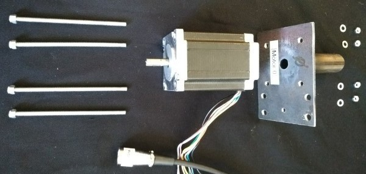
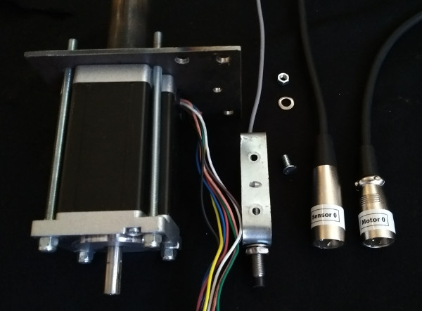
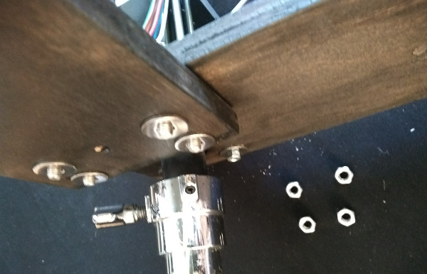

% Loeffler *H*


# Setup and assembly

## Software setup

1. Get the code from [GitHub](https://github.com/markk/loeffler-h). Click the
   `Clone or download` button and then `Download ZIP`.
1. Extract the zip archive in your `~/Documents` folder and rename the folder
   to `loeffler-h`.
1. Install [SuperCollider](https://supercollider.github.io/download).
1. Start the `SuperCollider IDE` and open the file
   `~/Documents/loeffler-h/supercollider/run.scd`.
1. Follow the instructions to install the class.
1. Read the rest of this file for details on running the software.

## Tools

### Included {.unnumbered}

- ratchet with 8mm (M4) and 10mm (M6) sockets
- mini screwdriver set
- hex key set

### Required {.unnumbered}

- flat-head screwdriver
- Phillips-head screwdriver
- adjustable spanner

## Hardware assembly

1. Attach `Motor`s to steel brackets, matching motor numbers and orienting the
   motor cables to the wide side of the bracket. Use four long M4 bolts, with
   washers and nuts. Tighten diagonally opposite bolts in order. Ensure the
   lock-nuts on the top of the motors are flush with the bolt. Tighten well as
   this will not be accessible later.
   

1. Attach `Sensor`s to steel brackets, matching the numbers. Use one 12mm M4
   screw, with a washer and nut. Tighten well as this will not be accessible
   later.
   

1. Attach `Motor` assemblies to `Base` boards on outer bolts with two 17mm
   washers and M4 nuts. Do not tighten yet.
   

1. Insert into percussion stands and adjust all four motors to the same height.

1. Join `Motor 0` to `Motor 1` with `Brace A` (underneath) using four M6 bolts.
   Include a washer on the brace side.
   

1. Join `Motor 2` to `Motor 3` with `Brace B`.

1. Tighten all 6 nuts on the underside of each motor assembly.
   

1. Attach `Beaters` to each motor and firmly tighten with the hex key. The top
   of the motor shaft should be flush with the top of the beater.
   

1. Check the beater can rotate freely without hitting the `Sensor`. The screw
   on the beater should pass directly over the sensor with a clearance of 1 mm.
   The sensor can be adjusted to align if necessary by bending the metal
   bracket or changing the height with the nuts. The depth of the beater screws
   can also be adjusted with a screwdriver.
   

1. Attach perspex `Guide`s with 25mm M5 screws. Do not overtighten.
   

## Electrical connections

1. Connect output cables from the `Driver box` to the `Motor` and `Sensor`
   cables. There are four 5-pin XLR extension cables included if necessary for
   the motor cables; the sensor cables can be extended with standard 3-pin XLR
   microphone cables. Keep cable runs as short as possible.
1. With the `Main Power` off, plug in the `Electronics Power`. The LEDs on the
   bottom of each sensor should be on unless the beater is over it. Check the
   beaters rotate freely and the sensor lights switch on and off accordingly.
   Adjust sensors if necessary. Leave the beaters turned so that one end is
   above the guide.
1. Unplug the `Electronics Power` and plug in the `Main Power`. Green LEDs
   should show on `Power A`, `Power B` and the four `Drivers`. Check that the
   four beaters are now held by the motors.
1. With the `Main Power` on, replug the `Electronics Power`. The four beaters
   should rotate to the sensor position and stop.
1. When powering on each time, switch on the `Main Power` first, then the
   `Electronics Power`, then lastly plug in the `USB` computer connection.

## TODO

- microphones
    - motor mics gaffer all the way around the motor
- electricals

# Operation details

## Action syntax

See `score.csv` for examples.

```
command [halfturns:H] [dir:l|r] pitch:P[-P][-P] [duration:D][-D] [recentre:c|n]
```

### Commands

- `t` — turn, e.g. `t 1 l 69` =
  one halfturn left at pitch 69.
- `d` — duration turn, e.g. `d r 60 3 n` =
  right turning for 3 beats at pitch 60, stop without finding sensor.
- `u` — turn until next command, e.g. `u l 64` =
  left turning at pitch 64 until next command sent.
- `s` — stop.
- `g` — duration gliss, e.g. `g r 57-69 1.5 c` =
  right turning gliss from pitch 57-69 over 1.5 beats, find sensor afterwards.
- `q` — double gliss, e.g. `q l 48-60-54 1-0.33 n` =
  left turning double gliss from pitch 48-60 over 1 beat, then from
  pitch 60-54 over 1/3 beat, stop without finding sensor.
- `T` — timed turn, e.g. `T 2 r 72 3` =
  two halfturns right over 3 beats. **N.B.** the pitch number is necessary but ignored.
- `G` — gliss, e.g. `G 3 l 66-60` =
  gliss from pitch 66-60 in 3 halfturns left. Duration is indeterminate.
- `S` — set sustain duration, e.g. `S 0.25` =
  set sustain duration to a quarter of a beat.

### Shortcut

- `h` = single halfturn at fastest speed, this is equivalent to `t 1 r 72`

### Halfturns

- 1-19 number of halfturns to complete

### Directions

- l = left
- r = right

### Pitches (motor speed)

- 36-72 (including quartertones, e.g. 40.5)

### Duration

- in beats at current tempo

### Recentre

- `c` = recentre
- `n` = do not recentre

# Troubleshooting

Check beaters rotate freely
